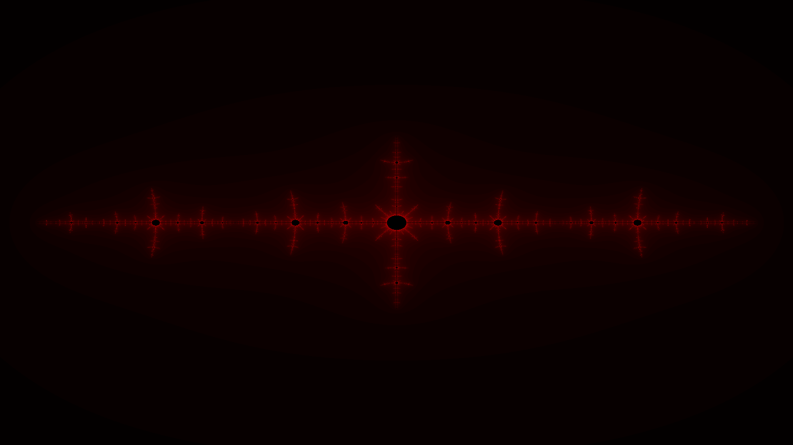

# Fractal Generator (Python)

This program generate fractals like the Julia Set or the Mandelbrot Set

## Summary

1. [Installation](#installation)
2. [Features](#features)
3. [Third Example](#third-example)
4. [Fourth Example](#fourth-examplehttpwwwfourthexamplecom)

## Installation

Use the package manager [pip](https://pip.pypa.io/en/stable/) to install numpy and pygame.

```bash
pip install numpy
pip install pygame
```

## Features

1. It can generate any Julia Set with a complex number given (z = a + ib) and the Mandelbrot Set
2. A GUI to change parameters (TODO)
3. An interactive window to zoom or move in the fractal  (TODO)

## Result
### Julia Set for c = -0.8 + i0.156



