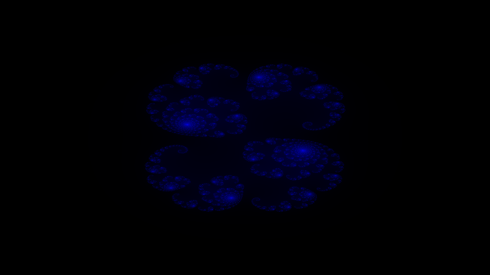
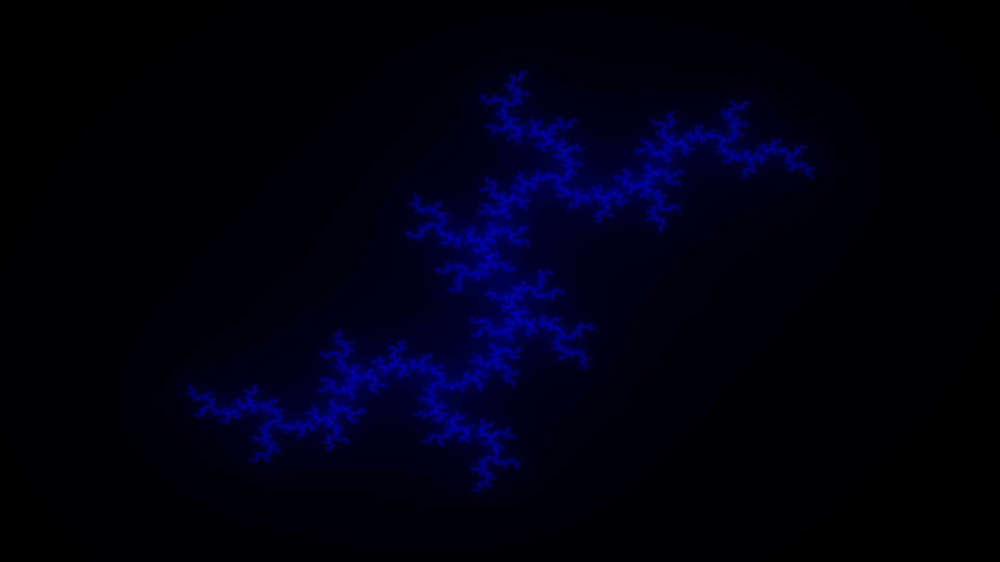
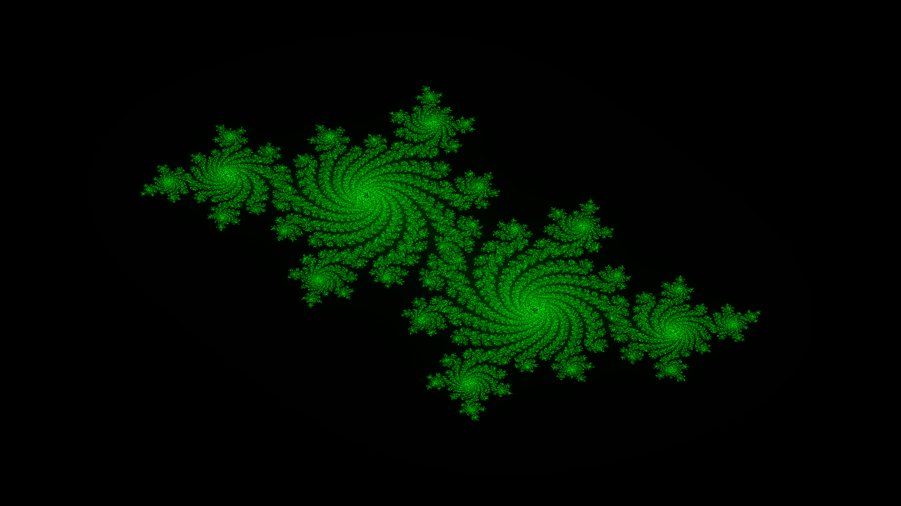
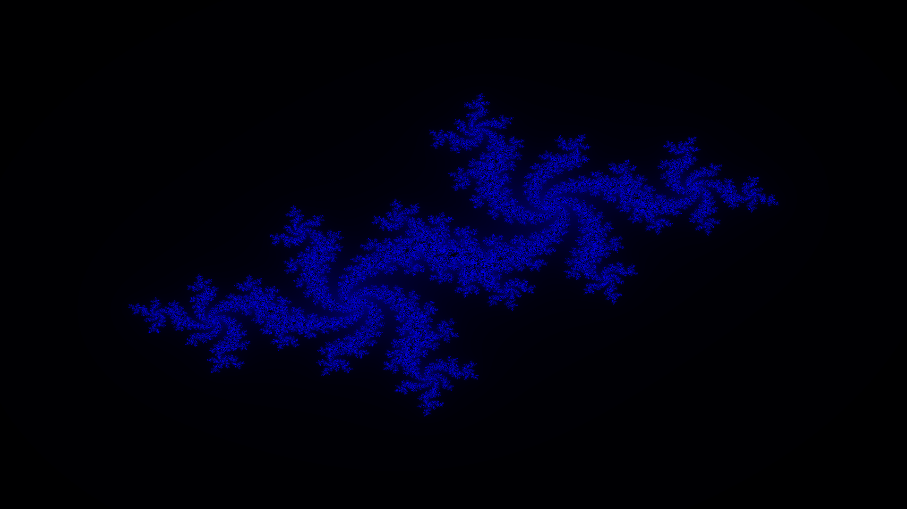

# Fractal Generator (Python)

This program generate fractals like the Julia Set or the Mandelbrot Set

## Summary

1. [Installation](#installation)
2. [Features](#features)
3. [Results](#result)

## Installation

Use the package manager [pip](https://pip.pypa.io/en/stable/) to install numpy, pygame and numba.

```bash
pip install numpy
pip install pygame
pip install numba
```

## Features

1. It can generate any Julia Set with a complex number given (z = a + ib) and the Mandelbrot Set
2. A GUI to change parameters (TODO)
3. An interactive window to zoom or move in the fractal  (TODO)

## Result
### Julia Set for c = 0.285 + i0.01 



### Julia Set for c = -1.476 + i0


### Julia Set for c = 0 + i0.8



### Julia Set for c = 0.355 + i0.355



### Julia Set for c = -0.4 - i0.59


